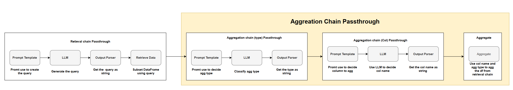

# 💬 Chatbot template

A simple Streamlit app that shows how to build a chatbot using OpenAI's GPT-4.1-nano with LangChain data aggregation capabilities for e-commerce dataset analysis.

[](https://chatbot-template.streamlit.app/)

## Architecture

The chatbot uses a multi-step LangChain pipeline for data retrieval and aggregation:



### Pipeline Flow:

1. **Retrieval Chain Passthrough**: 
   - Prompt Template → LLM → Output Parser → Retrieve Data
   - Generates pandas queries to filter CSV data

2. **Aggregation Chain Passthrough**:
   - **Type Detection**: Determines aggregation type (sum, mean)
   - **Column Selection**: Identifies target column for aggregation
   - **Final Aggregation**: Performs aggregation on filtered data

## How to run it on your own machine

1. Install the requirements

   ```
   $ pip install -r requirements.txt
   ```

2. Configure your OpenAI API key in Streamlit secrets

   ```
   # .streamlit/secrets.toml
   OPENAI_API_KEY = "your-api-key-here"
   ```

3. Run the app

   ```
   $ streamlit run streamlit_app.py
   ```

## Dataset

The app works with e-commerce-dataset.csv containing:
- transaction_id, transaction_date, customer_id, customer_name
- product_id, product_description, unit_price, quantity, total_order_size

## Usage Examples

Ask questions like:
- "Give me the total order values for Wireless Mouse with RGB Lighting"
- "What's the average unit price for all products?"
- "Sum the total_order_size for all transactions"
- "Mean quantity for Bluetooth Conference Speaker"

## Features

- Natural language querying of CSV data
- Automatic data filtering and aggregation
- Real-time chat interface
- LangChain integration for complex data processing